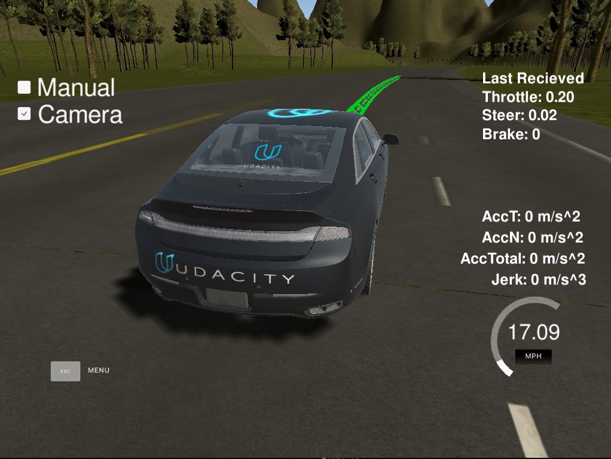
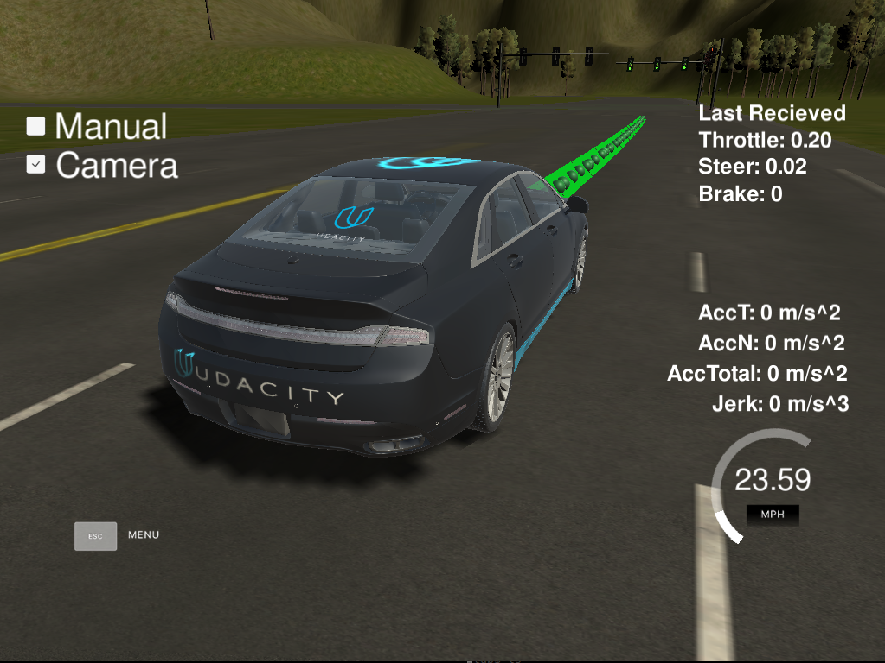
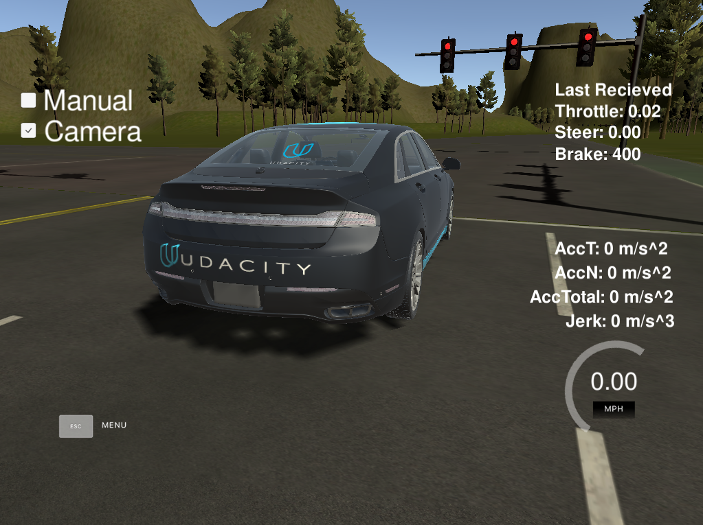

# Udacity Self-Driving Car Engineer Capstone -- System Integration


The goals of this project are the following:

* Launch correctly using the launch files provided in the capstone repo. Please note that we will not be able to accommodate special launch instructions or run additional scripts from your submission to download files. The launch/styx.launch and launch/site.launch files will be used to test code in the simulator and on the vehicle respectively. The submission size limit for this project has been increased to 2GB.
* Smoothly follow waypoints in the simulator.
* Respect the target top speed set for the waypoints' twist.twist.linear.x in waypoint_loader.py. Be sure to check that this is working by testing with different values for kph velocity parameter in /ros/src/waypoint_loader/launch/waypoint_loader.launch. If your vehicle adheres to the kph target top speed set here, then you have satisfied this requirement.
* Stop at traffic lights when needed.
* Stop and restart PID controllers depending on the state of /vehicle/dbw_enabled.
Publish throttle, steering, and brake commands at 50hz.

---

## Notes to Reviewer

Hi there! We are **Team Lambda**! 

|      Name     |        E-Mail        |     Role    |        Responsibility        |
|:-------------:|:--------------------:|:-----------:|:----------------------------:|
|     Ge Yao    | alexgecontrol@qq.com | Team Leader | Traffic Light Classification |
|   Jiho Choi   |  89jan25th@gmail.com | Team Member |       Waypoint Updator       |
| Xu Kuangzheng | kuang.work@gmail.com | Team Member |       Waypoint Updator       |
|   Sun Fengyi  |    85143781@qq.com   | Team Member |        DBW Controller        |

---

## Environment Setup

### 1. Clone This Repo

Clone the project repository
```bash
git clone https://github.com/AlexGeControl/Auto-Car-05-System-Integration-01-Udacity-Capstone.git
```

### 2. Set Up Docker Environment

1. [Install Docker](https://docs.docker.com/engine/installation/)

2. Change to project directory
    ```bash
    cd [YOUR_PROJECT_DIRECTORY]
    ```

3. Build the docker container for project
    ```bash
    docker build . -t capstone
    ```

4. Run the docker file
    ```bash
    docker run -it -v $PWD:/capstone -v /tmp/log:/root/.ros/ -p 4567:4567 capstone
    ```

### 3. Launch ROS
After entering docker, in the default entrypoint directory, execute the following commands:
```bash
cd ros
catkin_make
source devel/setup.sh
roslaunch launch/styx.launch
```

### 4. Run Simulator

1. Download [Udacity Capstone Project Simulator](https://github.com/udacity/CarND-Capstone/releases) 

2. Extract the file and make the programs runnable
```bash
unzip linux_sys_int.zip
chmod +x sys_int.x86
chmod +x sys_int.x86_64
```
3. Run the simulator

---

## Real World Testing

1. Download [training bag](https://s3-us-west-1.amazonaws.com/udacity-selfdrivingcar/traffic_light_bag_file.zip) that was recorded on the Udacity self-driving car.
2. Unzip the file
```bash
unzip traffic_light_bag_file.zip
```
3. Play the bag file
```bash
rosbag play -l traffic_light_bag_file/traffic_light_training.bag
```
4. Launch your project in site mode
```bash
cd CarND-Capstone/ros
roslaunch launch/site.launch
```
5. Confirm that traffic light detection works on real life images

---

## Performance Evaluation

### 1. Smoothly Follow Waypoints in the Simulator

The ego vehicle follows waypoints given smoothly in simulator



### 2. Respect the Target Top Speed Set for the Waypoints



### 3. Stop at Traffic Lights When Needed



### 4. Stop and Restart PID Controllers Depending on the State of /vehicle/dbw_enabled

This can be verified with <a href="src/twist_controller/dbw_node.py">DBW node source code</a>. Only when DBW node is enabled will autonomous control commands be sent to ego vehicle to actuate it.

```python
class DBWNode(object):
    """ generate drive-by-wire(DBW) command for autonomous driving
   
        @subscribed /vehicle/dbw_enabled:  the indicator for whether the car is under dbw or driver control
        @subscribed /current_velocity:     the vehicle's target linear velocities
        @subscribed /twist_cmd:            the vehicle's target angular velocities

        @published  /vehicle/brake_cmd:    the final brake for electronic control   
        @published  /vehicle/throttle_cmd: the final throttle for electronic control  
        @published  /vehicle/steering_cmd: the final steering for electronic control      
    """
    DBW_UPDATE_FREQ = 50 # Waypoint update frequency

    ...

    def loop(self):
        """ 
            The DBW system on Carla expects messages at 50Hz
            It will disengage (reverting control back to the driver) if control messages are published at less than 10hz
        """
        rate = rospy.Rate(DBWNode.DBW_UPDATE_FREQ) # at least 50Hz
        while not rospy.is_shutdown():
            # Get predicted throttle, brake, and steering using `twist_controller`
            throttle, brake, steer = self.controller.control(
                is_dbw_enabled = self.is_dbw_enabled,
                actual_longitudinal_velocity = self.actual_longitudinal_velocity,
                target_longitudinal_velocity = self.target_longitudinal_velocity,
                target_angular_velocity = self.target_angular_velocity
            )

            # Only publish the control commands if dbw is enabled
            if self.is_dbw_enabled:
                self.publish(throttle, brake, steer)
            rate.sleep()
```

### 5. Publish Throttle, Steering, and Brake Commands at 50hz

This can be verified with <a href="src/twist_controller/dbw_node.py">DBW node source code</a>. The control command publish frequency is set as 50Hz.

```python
class DBWNode(object):
    """ generate drive-by-wire(DBW) command for autonomous driving
   
        @subscribed /vehicle/dbw_enabled:  the indicator for whether the car is under dbw or driver control
        @subscribed /current_velocity:     the vehicle's target linear velocities
        @subscribed /twist_cmd:            the vehicle's target angular velocities

        @published  /vehicle/brake_cmd:    the final brake for electronic control   
        @published  /vehicle/throttle_cmd: the final throttle for electronic control  
        @published  /vehicle/steering_cmd: the final steering for electronic control      
    """
    DBW_UPDATE_FREQ = 50 # Waypoint update frequency

    ...

    def loop(self):
        """ 
            The DBW system on Carla expects messages at 50Hz
            It will disengage (reverting control back to the driver) if control messages are published at less than 10hz
        """
        rate = rospy.Rate(DBWNode.DBW_UPDATE_FREQ) # at least 50Hz
        while not rospy.is_shutdown():
            # Get predicted throttle, brake, and steering using `twist_controller`
            throttle, brake, steer = self.controller.control(
                is_dbw_enabled = self.is_dbw_enabled,
                actual_longitudinal_velocity = self.actual_longitudinal_velocity,
                target_longitudinal_velocity = self.target_longitudinal_velocity,
                target_angular_velocity = self.target_angular_velocity
            )

            # Only publish the control commands if dbw is enabled
            if self.is_dbw_enabled:
                self.publish(throttle, brake, steer)
            rate.sleep()
```